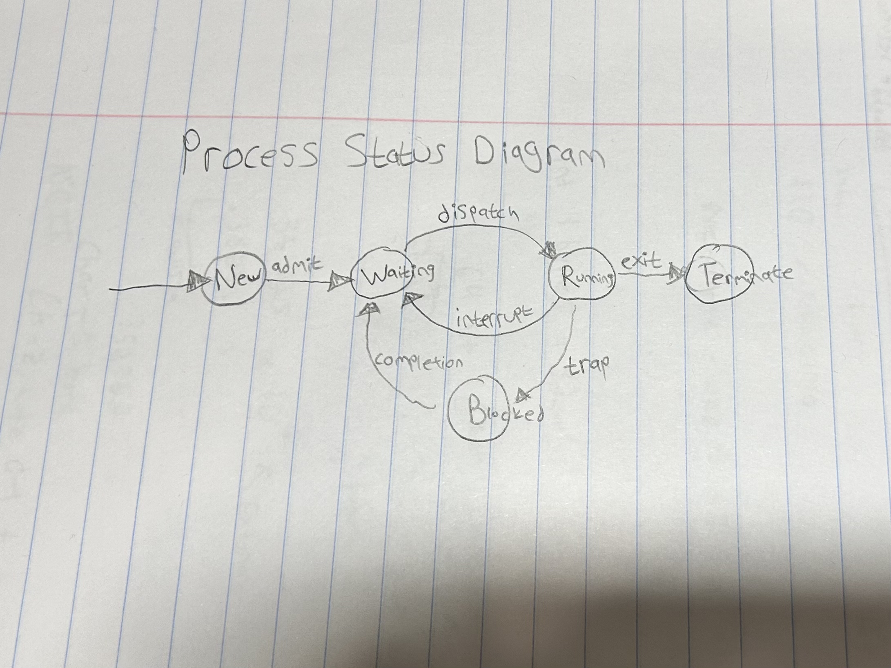

# Quiz #1: Models of Communication and Computation
### Date: Sep 29, 2023
### Timed Quiz: 1 hour
### Exam Time-frame
* Start: Friday: 17:00 (5:00pm)
* End: Sunday: 23:59 (11:59pm)

---
## Name: Jonathan Sher                                                 <!-- answer -->
## GitHub Account: jonathan-sher                                       <!-- answer -->


1. We can use a Finite State Machine (FSM) to model the interaction between the OS and your program.

On a piece of paper, 
   - draw the Process Status Diagram (PSD) on a piece of paper
   - label both it states and edges
   - take a picture your drawing
   - upload your picture to your computer
   - export your picture in PNG format with the name "PSD.png"
   - copy your "PSD.png" to this directory.<br>

  


1. An ISA is an abstraction for a physical computer.  This abstraction includes a defined set of characteristics.  Enumerate these defined characteristics.
   1. Supported instruction and their semantics     <!-- response -->
   1. Supported data types                          <!-- response -->
   1. Registers: size, number, and purpose          <!-- response -->
   1. Memory: layout, addressing, alignment, endiance <!-- response -->
   1. OS interface                <!-- response -->

<!-- You may add additional lines as needed; remember to add respons tags.  -->

1. Briefly describe the difference between a Sequential circuit and a Combinational Circuit.
```response
Combinational circuits are digital circuits that perform logic operations and produce an output based solely on the current inputs, using components like logic gates, with no memory or feedback loop. In contrast, sequential circuits have memory elements and can produce outputs based on both current inputs and past inputs, utilizing components like flip-flops and feedback loops, making them suitable for applications like counters and registers.
   ```

   <!-- You may add additional lines within the code block above, without the need to added additional response tag. -->


2. Define the following terms:
   1. trap
      - a synchronous event to request the kernel to perform an operation on behalf of the running program        <!-- response -->
   1. kernel
      -  the part of the Operating System stored in main memory which manages system resources, interacts directly with hardware, and provides essential services to other parts of the operating system and applications, serving as a bridge between software and hardware.    <!-- response -->
   1. rval
      - the value stored in memory for a variable   <!-- response -->
   1. interrupt
      - an asynchronous event that causes the kernel to execute  <!-- response -->


1. A 'Universal Computer' is an abstract machine based upon the Turing Machine.  This computer has a standardized control program to manage the underlying finite state machine. (This control program is akin to the computer firmware).  Two other programs are placed on the tape.  What are these two other programs:
1. A specialized program is placed on tape   <!-- response -->
1. A generic program is placed on tape       <!-- response -->


1. A Pushdown Automata (PDA) has more computational power than a Finite State Machine (FSM). What is the difference between the PDA and and FSM that provides the PDA with this additional power?
   1. A Finite State Machine (FSM) can only recognize regular languages as it has limited memory and relies solely on different states to process input strings.    <!-- response -->
   1. A Pushdown Automata (PDA) has a stack as auxiliary memory, allowing it to recognize context-free languages, which are more expressive and include many programming languages, giving it more computational power than an FSM.        <!-- response -->


1. Memory can be modeled as an array of bytes.  A register on the MIPS architecture contains 32 bits.  What role does endiance play when we execute an instruction to load a register with values stored within memory.
   ```response
   Endianness is defined as the order of bytes within a word and is crucial in MIPS architecture during register loading. In big-endian, the most significant byte (MSB) is at the lowest address, and in little-endian, the least significant byte (LSB) is at the lowest address. When a 32-bit register is loaded, the endianness determines the arrangement of bytes in the register from memory. A mismatch in endianness can lead to incorrect data arrangement in the register, causing computational errors, underscoring the importance of correct endianness handling in MIPS systems.           

              
   ```

1. Given the following configuration of memory, answer the following questions:
   1. What is the value stored in memory at location `0x0100 0002`: 
      - 54                                                <!-- response -->
   1. What is the label associated with location `0x0100 0009` in memory
      - D                                                 <!-- response -->
   1. What is the lval associated with `B`:  
      - 0x0100 0003                                       <!-- response -->
   1. What is the rval associated with `B`:
      - 202                                               <!-- response -->
   1. What is the rval associated with `C[3]`:
      - 77                                                <!-- response -->
   1. What is the lval associated with `C[3]`:
      - 0x0100 0004                                      <!-- response -->

|     | mem |              |
|-----|-----|--------------|
|     | 253 |  0x0100 000A |
| D:  |  42 |  0x0100 0009 |
|     |   0 |  0x0100 0008 |
|     |   1 |  0x0100 0007 |
|     |   2 |  0x0100 0006 |
| C:  |   3 |  0x0100 0005 |
|     |  77 |  0x0100 0004 |
| B:  | 202 |  0x0100 0003 |
|     |  54 |  0x0100 0002 |
| A:  | 123 |  0x0100 0001 |


